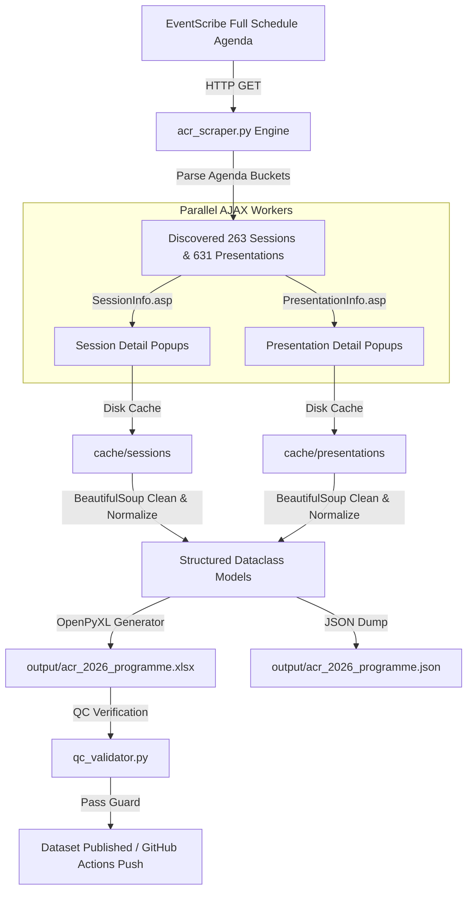

<div align="center">

# 🩺 ACR Convergence 2026 Programme & Abstract Scraper

**A high-performance, multi-threaded REST/AJAX conference extractor & quality-assured dataset pipeline for ACR Convergence 2026.**

[](https://www.python.org/)
[](https://github.com/saksham-phs/ACR_Scraper/actions)
[](#-data-schema--output-columns)
[](file:///C:/Users/SakshamSehrawat/Downloads/ACR_Scraper/qc_validator.py)

[Features](#-key-features) • [Data Schema](#-data-schema--output-columns) • [Quick Start](#-quick-start) • [Automation](#-github-actions-daily-automation) • [Quality Control](#-quality-control--validation)

---

</div>

## 📌 Overview

**ACR Convergence 2026** is the flagship medical meeting of the American College of Rheumatology. This repository provides an end-to-end automated extraction pipeline designed to scrape the full conference schedule from CadmiumCD's [EventScribe Platform](https://acrconvergence2026.eventscribe.net/agenda.asp?pfp=Browse%20by%20Day).

It extracts all **263 session buckets** and **631 presentation records** across all 6 conference days (Nov 6 – 11, 2026), capturing detailed faculty listings, institution affiliations, abstract bodies, and financial disclosures into a beautifully formatted OpenPyXL Excel workbook (`acr_2026_programme.xlsx`) and raw JSON backup.

---

## ⚡ Key Features

* 🚀 **Multi-Threaded Extraction**: Parallelized fetching via `ThreadPoolExecutor` (10 concurrent workers) completing full pulls (~894 AJAX detail popups) in seconds.
* 💾 **On-Disk Resilient Caching**: Automatic raw HTML disk caching (`cache/`) for fast, idempotent re-runs and zero redundant network overhead.
* 🎨 **Corporate OpenPyXL Styling**: Master Excel workbook styled with frozen header panes (`A2`), Segoe UI typography, corporate blue accent fills (`#D9E9F8`), and auto-fitted text wrapping.
* 👥 **Combined & Granular Authors/Affiliations**: Formats clean superscript author lists mapped to numbered institutional affiliations (`Authors_and_Affiliations`).
* 🛡️ **Automated Quality Control**: Built-in `qc_validator.py` suite enforcing mandatory null guards, schema matching, date/time formatting, and row counts.
* 🔄 **GitHub Actions Cloud Automation**: Pre-configured daily cron workflow (`.github/workflows/daily_scrape.yml`) that auto-updates datasets at 00:00 UTC and commits changes back to GitHub.

---

## 🏗️ System Architecture



---

## 📊 Data Schema & Output Columns

The master output dataset `output/acr_2026_programme.xlsx` contains **694 rows** across **23 standardized columns**:

| Column Name | Description | Example |
| :--- | :--- | :--- |
| **Session_ID** | Unique identifier for session bucket | `1829157` |
| **Session_Title** | Complete title of the session | `Basic Musculoskeletal Ultrasound Course I` |
| **Session_Type** | Track, Course & General Topic tags | `Hands-On Training \| Ultrasound \| Preconference` |
| **Room** | Hall or room location | `Convention Center Room 102` |
| **Date** | Formatted event date | `06 November 2026` |
| **Day** | Conference day of the week | `Friday` |
| **Time** | Session start & end time range | `7:20 AM - 5:50 PM East Coast USA Time` |
| **Chairs** | Session chairs, faculty & moderators | `Pankaj Bansal, MD \| Edgar Martorell, MD` |
| **Chairs_Geography** | Institutional & city affiliations of chairs | `Orlando Arthritis Clinic, Orlando, Florida` |
| **Session_Description**| Overview, learning objectives & goals | `Full description of course objectives...` |
| **Session_URL** | Direct AJAX/Web URL for session | `.../ajaxcalls/SessionInfo.asp?PresentationID=...` |
| **Presentation_ID** | Unique presentation identifier | `1829154` |
| **Presentation_Title**| Title of individual presentation/talk | `Scan B1: Hand/Wrist` |
| **Presenter** | Speaker / presenter full names | `Heather Benham, DNP \| Alvin Day, MD` |
| **Presentation_Time** | Talk start & end time range | `8:00 AM - 9:40 AM East Coast USA Time` |
| **Authors** | All presentation authors/contributors | `Heather Benham, DNP, APRN, CPNP, RhMSUS` |
| **Authors_and_Affiliations**| Formatted author list + numbered affiliations | `Authors: Heather Benham (1)... \nAffiliations: (1)...` |
| **Presenter_Geography**| Presenter institution & location | `Scottish Rite Hospital, North Richland Hills, TX` |
| **Presentation_Type**| Category / Track name | `Ultrasound Conferences` |
| **Keywords** | Keywords & tags | `Ultrasound, Musculoskeletal` |
| **Abstract_Full_Text**| Complete abstract body text | `Background: ... Methods: ... Results: ...` |
| **Acknowledgments_and_Disclosures**| Presenter financial disclosures | `Disclosure(s): No financial relationships...` |
| **Presentation_URL** | Direct URL to presentation detail | `.../ajaxcalls/PresentationInfo.asp?PresentationID=...` |

---

## 🚀 Quick Start

### Prerequisites
* Python 3.11+
* PowerShell or Terminal

### 1. Installation

Clone the repository and install requirements:

```bash
git clone https://github.com/saksham-phs/ACR_Scraper.git
cd ACR_Scraper
pip install -r requirements.txt
```

### 2. Running the Scraper

```bash
# Standard Run (uses local cache/ if available for instant execution)
python acr_scraper.py

# Force Refresh Run (bypasses cache and pulls fresh data from eventscribe.net)
python acr_scraper.py --force
```

### 3. Running Quality Assurance Validation

Verify dataset integrity, null coverage, and OpenPyXL formatting:

```bash
python qc_validator.py
```

---

## 🤖 GitHub Actions Daily Automation

This repository includes a pre-configured **GitHub Actions Workflow** (`.github/workflows/daily_scrape.yml`) that automatically runs the scraper in the cloud every day.

```yaml
# Workflow Schedule
on:
  schedule:
    - cron: '0 0 * * *' # Midnight UTC (5:30 AM IST)
  workflow_dispatch: # Manual trigger button in GitHub UI
```

### Setup Instructions for GitHub Actions:
1. Push this project to your GitHub repository.
2. Open your GitHub repo ➔ Go to **Settings** ➔ **Actions** ➔ **General**.
3. Under **Workflow permissions**, select **Read and write permissions** and click **Save**.
4. To run manually anytime: Go to **Actions** tab ➔ **Daily ACR 2026 Programme Scraper** ➔ **Run workflow**.

---

## 🛡️ Quality Control & Validation Metrics

The `qc_validator.py` suite enforces strict validation criteria on every run:

```text
======================================================================
      ACR CONVERGENCE 2026 SCRAPER QUALITY CONTROL (QC) VALIDATOR
======================================================================
[OK] Found output file: acr_2026_programme.xlsx (186.6 KB)
[OK] Workbook loaded. Data rows: 694, Columns: 23
[OK] Column count and headers match expected schema (23 columns).

--- Mandatory Field Null Checks ---
Session_Title null count: 0 / 694  (0.0% nulls)
Session_ID null count:    0 / 694  (0.0% nulls)
Date null count:          0 / 694  (0.0% nulls)

--- Presentation Level Field Coverage ---
Presentations with Titles:             631 / 694 (90.9%)
Presentations with Presenters/Authors: 589 / 694 (84.9%)
Presentations with Affiliations:       589 / 694 (84.9%)
Presentations with Disclosures:        537 / 694 (77.4%)

--- Excel Formatting & Layout Checks ---
Freeze Panes Setting: A2

======================================================================
   QC RESULT: ALL CHECKS COMPLETED SUCCESSFULLY - VERIFICATION PASSED
======================================================================
```

---

## 📁 Repository Structure

```text
ACR_Scraper/
├── .github/
│   └── workflows/
│       └── daily_scrape.yml    # GitHub Actions daily schedule
├── output/
│   ├── acr_2026_programme.xlsx # Master Excel Workbook
│   └── acr_2026_programme.json # Raw JSON Data Backup
├── cache/                      # Local HTML cache directory
├── acr_scraper.py              # Main Extractor Engine
├── qc_validator.py             # Quality Control Verification Suite
├── requirements.txt            # Python Dependencies
├── .gitignore                  # Git Ignore Rules
└── README.md                   # Project Documentation
```

---

<div align="center">

Developed with ❤️ for Medical Data Science & Conference Research.

</div>
